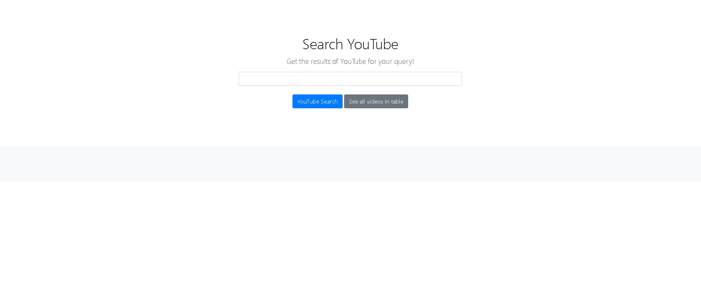
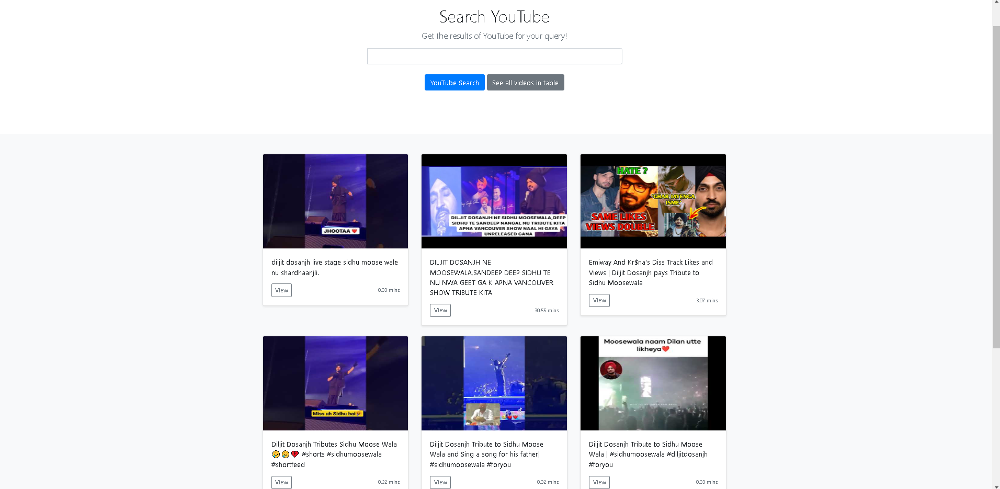
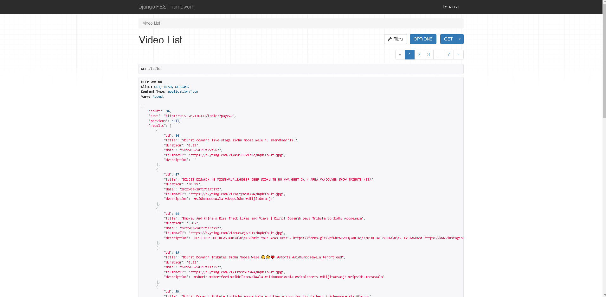
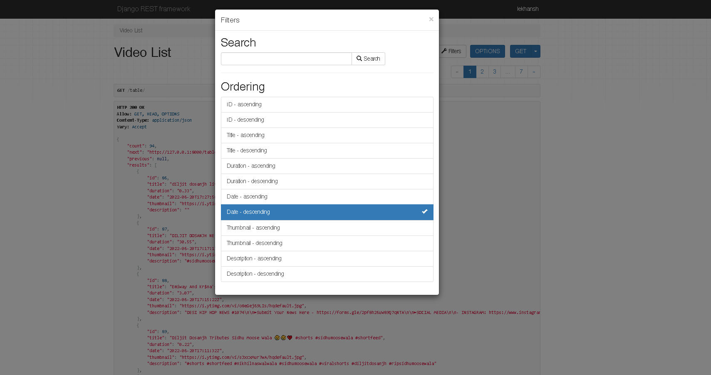
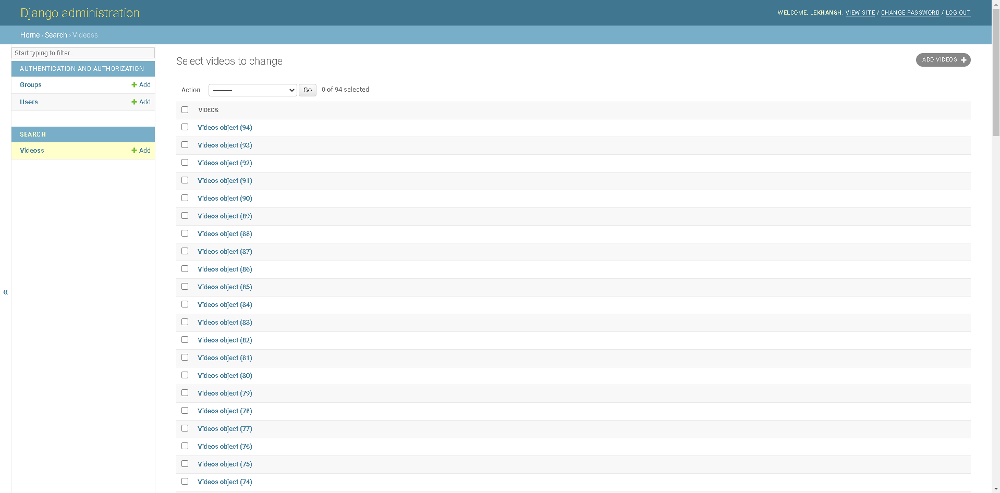
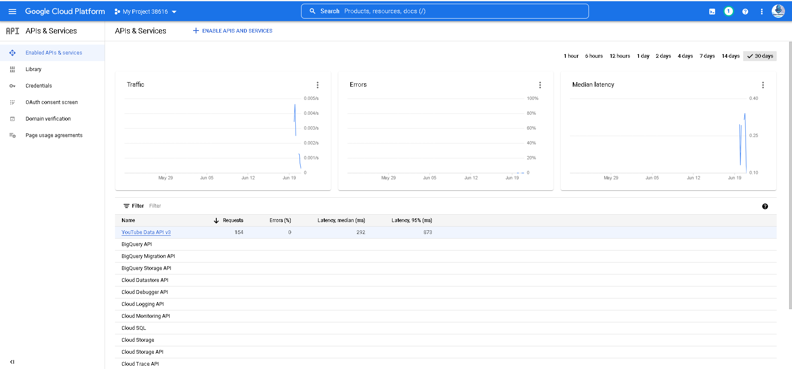

# Project Goal

To make an API to fetch latest videos sorted in reverse chronological order of their publishing date-time from YouTube for a given tag/search query in a paginated response.


## Tech Stack

* Django
* Django Rest Framework
* YouTube data v3 API
* HTML
* CSS
* Dockerfile


## Setup and Deployment

* Download Docker desktop app from [Here](https://www.docker.com/get-started/)

* To deploy this project, clone the repository

```bash
  git clone https://github.com/Lekhanshlkr/youtube_search.git
```

* Go to the folder

```bash
  cd youtube_search
````

* Modify `settings.py` File - Remove the existing key and add your own YouTube Data API key. Get a new API key from [Here](https://console.cloud.google.com/apis/library)

```bash
  YOUTUBE_DATA_API_KEY = <YOUR_KEY>
````

* Run the commands in `commands.txt` file in the given order.
## How to Use

* Post Deployment, Go to [Dashboard](http://127.0.0.1:8000)

* You can search for the videos from the search tab.

* On clicking `Youtube Search`, it will show the first 9 videos in reverse chronological order of their publishing date-time.

* On clicking `See all videos in table`, you will be redirected to the Rest Framework page where you can see all the stored videos in a paginated view with searching and sorting options.


## Screenshots

HomePage  <br>
Search Results  <br>
Videos List View  <br>
Search and Filter Options   <br>
Database View in admin panel   <br>
API Usage Panel in Google Console   <br>


## Further Optimizations

* The API can be called continuously in background with some interval using `asyncio` and instead of fetching 9 results, it can be limited to 1-2 results per call.

* The search parameter `publishedAt` can be set to less than _'30 minutes from current time'_ so that everytime the API is called, it only displays the results of videos which have been published in the last 30 minutes.

* A support for supplying multiple API keys can be added by supplying a _'list'_ in the `YOUTUBE_DATA_API_KEY` variable and then running a _'try except'_ block to check whether the API has been fully exhausted or not.

* Larger databases such as `PostgreSQL` and `MySQL` can be used for handling large amounts of data storage.

* A job queue call using `Celery` can be implented, to handle multiple 'GET' request at the same time.


## Feedback

If you have any feedback, please reach out to me at lekhilkr@gmail.com

<br>
<br>

[](https://forthebadge.com)

